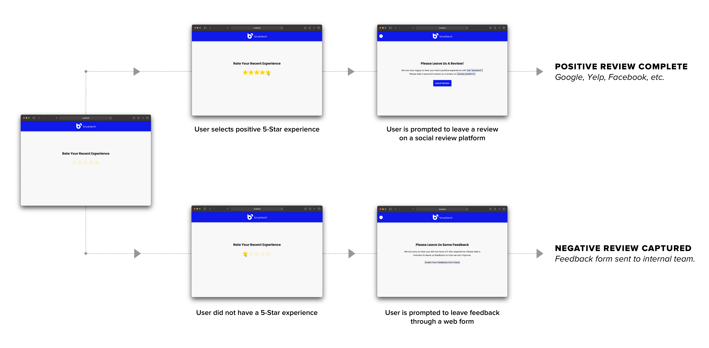
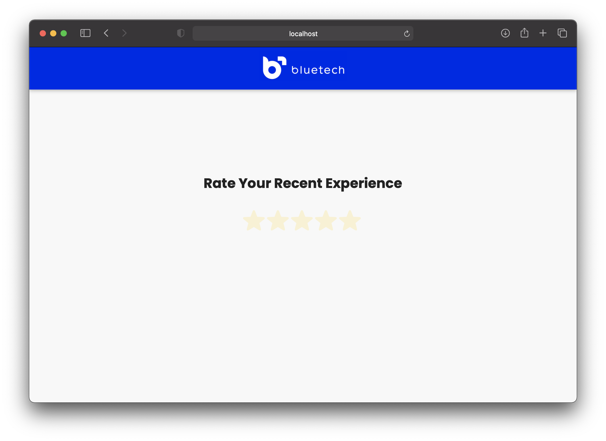
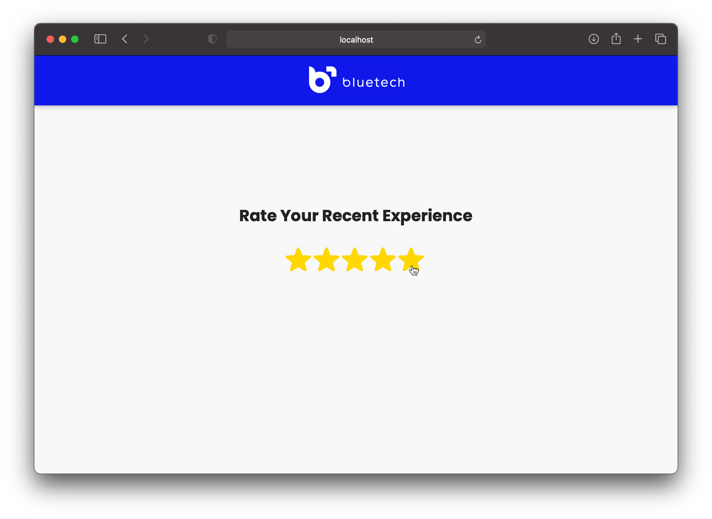
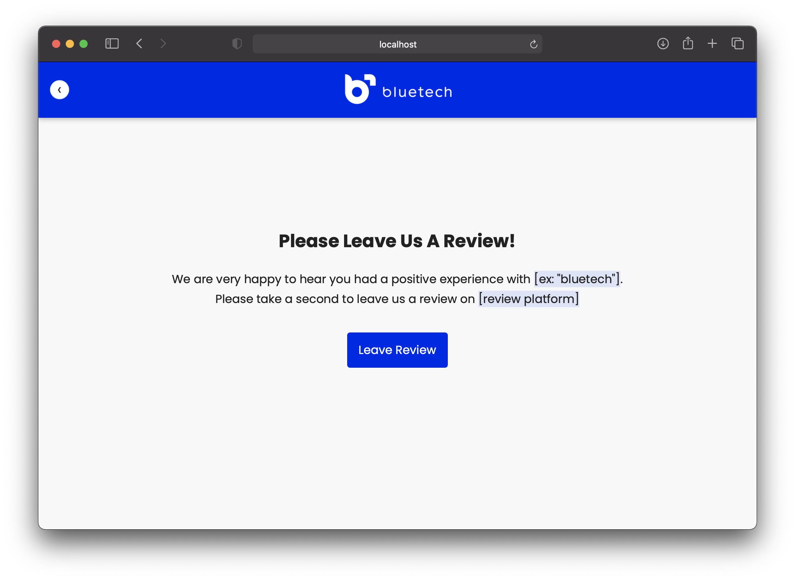
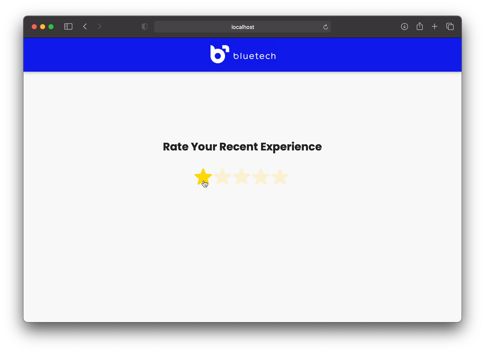
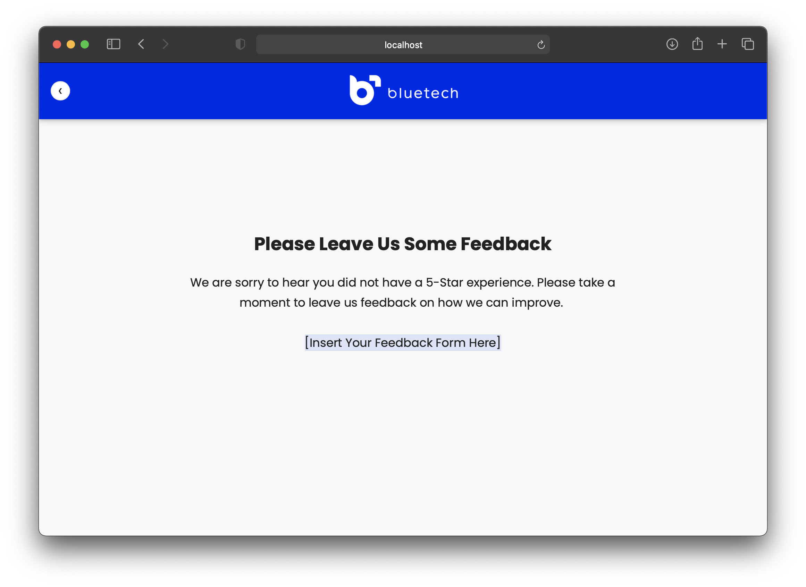

# Review Gate

### Inspiration

Contracted to consult on digital strategy to help the client build stronger brand awareness/reputation across various platforms

- **Goal:** Build 5-star reviews across various social profiles and/or review sites, such as: Google My Business, Yelp, Facebook Business, etc.
- **Friction Point:** Client was hesitant to push reviews to all customers (new or previous) because of possible 1-star reviews
- **Solution:** Build a review gate to capture bad reviews and promote 5 star reviews to various platforms
- **Outcome:** 1275% increase of 5-star reviews within ~6 months (from 4 to 55). SEO also yielded great results for local searches related to service :)

I published this jQuery plugin because to my surprise there were no quick out of the box solutions that were free. I've used this plugin multiple times for many clients across various industries and saw great results. Hope this helps anyone looking to quickly create a marketing review gate.

## Plugin Description

Review gate made with jQuery to capture user reviews that are not 5-star quality. This helps businesses collect both negative and positive feedback to better enhance their customer service experience.

The screenshot(s) below use a fake/pseudo company to illustrate the review gate.

## Quick Start

### HTML Markup Sample

```html
<nav class="review-gate-navbar" style="display: none">
  <button class="review-gate-navbar__btn">&#10094;</button>
  <div class="review-gate-navbar__logo-wrapper">
    
  </div>
</nav>

<main>
  <div id="review-gate">
    <section class="review-step">
      <h2 class="review-title">Rate Your Recent Experience</h2>
    </section>
    <section class="review-step">
      <h2 class="review-title">Please Leave Us A Review!</h2>
      <p>
        We are very happy to hear you had a positive experience with [ex:
        "bluetech"]. Please take a second to leave us a review on [review
        platform]
      </p>
      <a class="btn leave-review-btn" href="#">Leave Review</a>
    </section>
    <section class="review-step">
      <h2 class="review-title">Please Leave Us Some Feedback</h2>
      <p>
        We are sorry to hear you did not have a 5-Star experience. Please take a
        moment to leave us feedback on how we can improve.
        <br />
        <br />
        [Insert Your Feedback Form Here]
      </p>
    </section>
  </div>
</main>
```

### On Document Ready

```javascript
var config = {
  navbarColor: "#0f18e9",
  onUpdate: function (count) {
    if (count >= 5) {
      // Do something on good review
      $("#review-gate").reviewGate("step", 2);
    } else {
      // Do something on bad review
      $("#review-gate").reviewGate("step", 3);
    }
  },
};

$(document).ready(function () {
  $("#review-gate").reviewGate(config);
});
```

## Default Configs

If you do not specify a config object when you initialize the review gate the following will be used:

```javascript
var defaults = {
  stepClassName: "review-step",
  navbarColor: "#fff",
  navBarClassName: "review-gate-navbar",
  navBarBackBtnClassName: "review-gate-navbar__btn",
  enableNavBackBtn: true,
  emojiConfig: {
    emoji: "star",
    fontSize: 42,
    attributes: {
      id: "emoji-ratings-wrapper",
      // You can spread additional HTML attributes to your emoji element wrapper.
      // By default, only an ID attribute is used.
    },
    css: {},
  },
  onUpdate: function () {
    alert("Add an onUpdate function");
  },
};
```

| Property               | Type     |
| ---------------------- | -------- |
| stepClassName          | String   |
| navBarColor            | String   |
| navBarClassName        | String   |
| navBarBackBtnClassName | String   |
| enableNavBackBtn       | Boolean  |
| emojiConfig            | Object   |
| onUpdate               | Function |

## Installation Methods

### Clone the Repo

```console
https://github.com/davidkim10/jquery-review-gate.git
```

### Build Minified Files

```console
npm run build
```

Load the review gate JS file after jQuery.

```html
<!--Example: JS Dependencies -->
<script src="/path/to/js/jquery.min.js" defer></script>
<script src="/path/to/js/review-gate.jquery.js" defer></script>
```

### NPMJS

Download the NPM package

```console
npm i jquery-review-gate
```

### JSDelivr CDN

Use the [JSDelivr](https://www.jsdelivr.com/github) CDN links below to upload the JS libraries to your project.

```html
<!-- Load this after jQuery library -->
<script src="https://cdn.jsdelivr.net/gh/gellerby/jquery-emoji-ratings@master/dist/jquery.emojiRatings.min.js"></script>
<script src="https://cdn.jsdelivr.net/gh/davidkim10/jquery-review-gate@master/js/review-gate.jquery.min.js"></script>
```

## Font Used In Demo

font-family: 'Poppins', sans-serif;

**Google Fonts CDN:**

```html
<link
  href="https://fonts.googleapis.com/css2?family=Poppins:wght@400;700&display=swap"
  rel="stylesheet"
/>
```

## User Journey



## Screenshots






